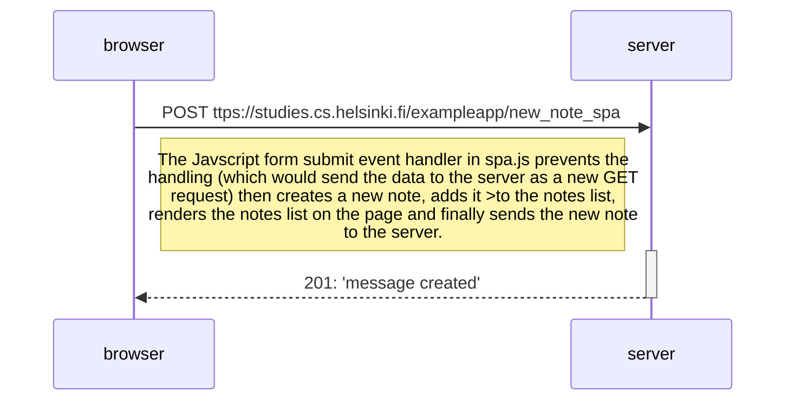

```mermaid
sequenceDiagram
    participant browser
    participant server

    browser->>server: POST ttps://studies.cs.helsinki.fi/exampleapp/new_note_spa
    Note right of browser: The Javscript form submit event handler in spa.js prevents the <br>handling (which would send the data to the server as a new GET <br> request) then creates a new note, adds it >to the notes list, <br>renders the notes list on the page and finally sends the new note <br>to the server.
    activate server
    server-->>browser: 201: 'message created'
    deactivate server

```